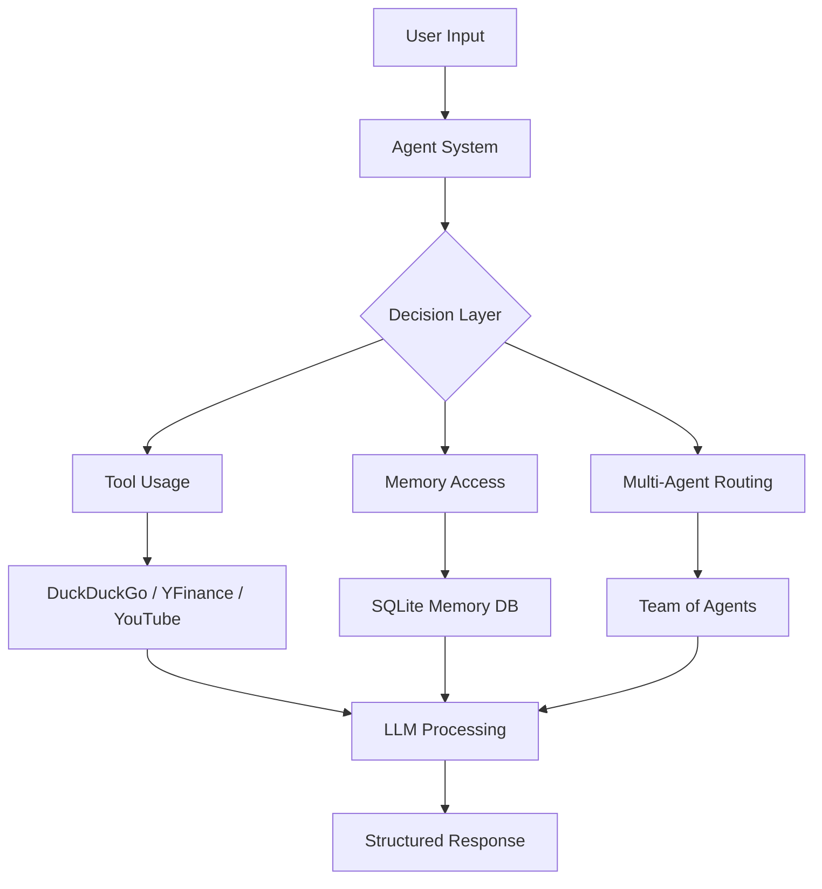

# AI / ML: Agentic AI

---

# 🚀 Agentic AI Systems — End-to-End Implementation with Agno

> **Production-Ready Multi-Agent AI Systems | Prime AI/ML Batch**


---

## 🧠 Overview

This repository presents a **complete implementation of Agentic AI systems**, built during the _Agentic AI module_ of the Prime AI/ML program.

Unlike traditional LLM applications, this project focuses on **autonomous agents that can:**

- Use tools
- Maintain memory
- Collaborate with other agents
- Analyze real-world data
- Be deployed as interactive applications

---

## 🎓 Topics Covered (From Course Module)

Based on your coursework progression:

- Introduction to Agentic AI
- Agentic AI vs Traditional AI Agents
- Agent Frameworks & Platforms
- Core Concepts of Agentic AI
- Building First Agent (Agno)
- Finance Agent
- Multi-Agent Teams
- Agents with Memory
- YouTube Analyzer Agent
- Deployment with Streamlit

---

## 🏗️ System Architecture



---

## ⚙️ Tech Stack

| Category  | Technologies                  |
| --------- | ----------------------------- |
| Language  | Python                        |
| Framework | Agno                          |
| Models    | Groq (Qwen 32B), OpenAI       |
| Tools     | DuckDuckGo, YFinance, YouTube |
| Memory    | SQLite                        |
| UI        | Streamlit                     |
| Env Mgmt  | dotenv                        |

---

## 📂 Project Structure

```bash
.
├── agent.py                # Tool-enabled travel agent
├── finance.py              # Financial analysis agent
├── memory.py               # Persistent memory agent
├── team.py                 # Multi-agent collaboration system
├── youtube_analyzer.py     # YouTube analysis agent
├── ui.py                   # Streamlit frontend
├── README.md               # Documentation
```

---

## 🔍 Core Implementations

---

### 🧭 1. Tool-Enabled Agent (Travel Assistant)


- Uses **DuckDuckGo tools**
- Adds **real-time context (date/time)**
- Performs **web-assisted reasoning**

```python
Agent(
    model=Groq(id="qwen/qwen3-32b"),
    tools=[DuckDuckGoTools()],
    instructions="You are a helpful and expert travel agent."
)
```

📄 Source:

---

### 📊 2. Finance Agent (Real-Time Market Analysis)


- Fetches **stock prices**
- Provides **analyst recommendations**
- Uses **tabular markdown outputs**

```python
tools=[YFinanceTools(), DuckDuckGoTools()]
```

📄 Source:

---

### 🧠 3. Memory-Enabled Agent (Persistent Intelligence)


- Stores user data in **SQLite**
- Retrieves past interactions
- Enables **personalized AI**

```python
enable_user_memories=True
add_history_to_context=True
```

📄 Source:

---

### 👥 4. Multi-Agent System (Team Collaboration)


- Multiple agents:
  - English 🇬🇧
  - Chinese 🇨🇳
  - Hindi 🇮🇳

- Coordinated via **Team Leader**
- Parallel responses

```python
Team(
    members=[eng_agent, chi_agent, hindi_agent],
    instructions="All agents must respond"
)
```

📄 Source:

---

### 🎥 5. YouTube Video Analyzer Agent


- Extracts:
  - Metadata
  - Timestamps
  - Topic segmentation

- Uses **OpenAI + YouTube tools**

📄 Source:

---

### 🌐 6. Streamlit Deployment (Real App)


- Interactive UI
- Real-time agent execution
- Cached agent loading

```python
video_url = st.text_input("Enter Youtube Video Link")
```

📄 Source:

---

## 🔄 End-to-End Workflow

```text
User Query
   ↓
Agent (LLM + Instructions)
   ↓
Decision Making
   ├── Tool Use
   ├── Memory Retrieval
   └── Multi-Agent Routing
   ↓
Execution
   ↓
Structured Response (Markdown/UI)
```

---

## 🧪 Real Use Cases

- 🌍 Travel safety recommendations
- 📈 Stock analysis & investment insights
- 🧠 Personalized assistants with memory
- 🌐 Multilingual AI systems
- 🎥 Automated YouTube content analysis

---

## ⚠️ Challenges Faced

- Tool selection reliability
- Prompt engineering complexity
- Memory consistency handling
- Multi-agent coordination
- Debugging agent workflows

---

## 📈 Key Learnings

- **Agent = LLM + Tools + Reasoning + Memory**
- Memory transforms stateless LLMs into **stateful systems**
- Multi-agent systems enable **parallel intelligence**
- UI deployment is essential for **real-world usability**
- Prompt design directly impacts **agent behavior**

---

## 🔮 Future Enhancements

- 🔹 Retrieval-Augmented Generation (RAG)
- 🔹 Vector DB (FAISS / Pinecone)
- 🔹 Autonomous planning agents (AutoGPT-style)
- 🔹 Voice-based agents
- 🔹 FastAPI + Docker deployment

---

## 👨‍💻 Author

**Satinder Singh Sall**
_AI/ML Engineer | Agentic AI Specialist_

📍 Prime AI/ML Batch
📅 April 2026

---

## 🏁 Conclusion

This project demonstrates a **complete transition from LLM usage → Agentic AI systems**, covering:

- Tool usage
- Memory
- Multi-agent collaboration
- Deployment

> 🚀 _Agentic AI is the foundation of next-generation intelligent systems._

---

## ⭐ Portfolio Impact

This project showcases:

- ✅ Real-world AI system design
- ✅ Multi-agent orchestration
- ✅ Production-ready deployment
- ✅ Strong understanding of modern AI paradigms

---

# 🤖 Agentic AI Systems with Agno Framework

> **Academic + Portfolio Project | Prime AI/ML Batch**


---

## 📌 Overview

This project demonstrates the design and implementation of **Agentic AI systems** using the **Agno framework**, focusing on building intelligent, tool-using, and collaborative AI agents.

The work spans from **basic agents** to **multi-agent systems**, including:

- Tool-integrated AI agents
- Financial analysis agents
- Memory-enabled agents
- Multi-agent collaboration (Teams)
- YouTube video analysis agent
- Streamlit-based deployment

---

## 🎯 Objectives

- Understand the concept of **Agentic AI**
- Build **autonomous AI agents with tools**
- Implement **multi-agent collaboration systems**
- Enable **memory and context awareness**
- Deploy AI agents using **Streamlit UI**

---

## 🧠 Key Concepts Covered

### 🔹 1. Agentic AI Fundamentals

- Difference between traditional LLMs vs agents
- Tool usage and decision-making
- Context-aware reasoning

### 🔹 2. Tool-Integrated Agents

- Search tools (DuckDuckGo)
- Financial data tools (Yahoo Finance)
- YouTube data extraction

### 🔹 3. Multi-Agent Systems

- Agent collaboration
- Task distribution
- Role-based responses

### 🔹 4. Memory in Agents

- Persistent memory using SQLite
- User-specific context retention
- Conversational continuity

### 🔹 5. AI Deployment

- Streamlit-based UI
- Interactive applications
- Real-time inference

---

## 📂 Project Structure

```bash
.
├── agent.py                 # Basic tool-enabled agent (travel assistant)
├── finance.py               # Financial analysis agent
├── memory.py                # Agent with persistent memory
├── team.py                  # Multi-agent collaboration system
├── youtube_analyzer.py      # YouTube analysis agent
├── ui.py                    # Streamlit frontend
├── README.md                # Project documentation
```

---

## ⚙️ Tech Stack

| Category    | Tools / Libraries             |
| ----------- | ----------------------------- |
| Language    | Python                        |
| Framework   | Agno                          |
| Models      | Groq (Qwen), OpenAI           |
| Tools       | DuckDuckGo, YFinance, YouTube |
| Database    | SQLite                        |
| UI          | Streamlit                     |
| Environment | dotenv                        |

---

## 🚀 Core Implementations

### 🔹 1. Basic Agent (Tool-Enabled)

A travel assistant agent that uses search tools for real-time information.

- Uses **DuckDuckGo tools**
- Adds **date-time context**
- Responds in **Markdown format**

📄 Reference:

---

### 🔹 2. Finance Agent 📈

An intelligent financial analyst agent that:

- Fetches stock data
- Provides analyst recommendations
- Uses structured markdown output

📄 Reference:

---

### 🔹 3. Memory-Enabled Agent 🧠

Implements **persistent memory** using SQLite:

- Stores user identity
- Retrieves past interactions
- Enables personalized responses

📄 Reference:

---

### 🔹 4. Multi-Agent System (Team) 👥

A collaborative system with multiple agents:

- English Agent
- Chinese Agent
- Hindi Agent

All agents respond simultaneously under a **team leader**.

📄 Reference:

---

### 🔹 5. YouTube Video Analyzer 🎥

An advanced agent that:

- Extracts video metadata
- Generates timestamps
- Provides structured content analysis

📄 Reference:

---

### 🔹 6. Streamlit Deployment 🌐

Interactive UI for real-world usage:

- Accepts YouTube links
- Displays AI-generated analysis
- Uses caching for performance

📄 Reference:

---

## 🔄 System Architecture

```
User Input
   ↓
Agent (LLM + Instructions)
   ↓
Tool Selection (Search / Finance / YouTube)
   ↓
Execution
   ↓
Response (Markdown / Structured Output)
```

---

## 🧪 Example Use Cases

- 🌍 Travel safety recommendations
- 📊 Stock market insights
- 🧠 Personalized assistants with memory
- 🌐 Multilingual responses
- 🎥 Automated video analysis

---

## ⚠️ Challenges Faced

- Tool selection accuracy
- Managing multi-agent coordination
- Memory consistency
- Prompt engineering for reliability
- Debugging agent workflows

---

## 📈 Key Learnings

- Agents are **LLMs + tools + reasoning**
- Memory significantly improves user experience
- Multi-agent systems enable **parallel intelligence**
- Prompt design directly impacts performance
- Real-world deployment requires **UI + backend integration**

---

## 🔮 Future Enhancements

- 🔹 Add RAG (Retrieval-Augmented Generation)
- 🔹 Integrate vector databases (FAISS / Pinecone)
- 🔹 Add voice-based interaction
- 🔹 Improve agent planning (AutoGPT-style)
- 🔹 Deploy using FastAPI + Docker

---

## 👨‍💻 Author

**Satinder Singh Sall**
_AI/ML Engineer | Agentic AI Enthusiast_

**Course:** Prime AI/ML Batch
**Module:** Agentic AI
**Date:** April 2026

---

## 📄 License

This project is intended for **academic and educational purposes only**.

---

## ⭐ Portfolio Note

This project demonstrates:

- ✅ Practical implementation of **Agentic AI systems**
- ✅ Experience with **LLM orchestration frameworks**
- ✅ Ability to build **production-ready AI applications**
- ✅ Understanding of **multi-agent collaboration & memory systems**

---
